# BYOPH Series - Mermaid Diagrams

All diagrams for the LinkedIn article series. Copy and render these using any Mermaid-compatible tool.

---

## Article 1: Introduction & Theory

### Diagram 1.1: Attack Chain Overview

```mermaid
flowchart LR
    subgraph "BYOPH Attack Chain"
        A[📧 Attacker sends .reg file] --> B[📥 User imports .reg]
        B --> C[📝 Protocol handler registered]
        C --> D[🔗 User clicks malicious link]
        D --> E[💥 Arbitrary code execution]
    end

    style A fill:#e74c3c,color:#fff
    style E fill:#e74c3c,color:#fff
    style C fill:#3498db,color:#fff
```

### Diagram 1.2: Registry Structure

### Diagram 1.3: Execution Flow

```mermaid
sequenceDiagram
    participant U as 👤 User
    participant A as 🌐 Application
    participant S as 🪟 Windows Shell
    participant R as 📁 Registry
    participant H as ⚡ Handler

    U->>A: Clicks link sample://hello
    A->>S: ShellExecuteEx()
    S->>R: Query HKCU\Software\Classes\sample
    alt Found in HKCU
        R-->>S: Return command
    else Not in HKCU
        S->>R: Query HKLM
        R-->>S: Return command
    end
    S->>H: CreateProcess()
    H-->>U: Handler executes
```

---

## Article 2: Attack Analysis

### Diagram 2.1: Attack Sequence

---

## Article 3: Lab Setup

### Diagram 3.1: Handler Execution Flow

```mermaid
flowchart TD
    A[🚀 Handler.exe starts] --> B[📋 Parse command line]
    B --> C[🔗 Extract URL argument]
    C --> D[📝 Write to log file]
    D --> E[💬 Show MessageBox]
    E --> F[✅ Exit cleanly]

    style A fill:#3498db,color:#fff
    style F fill:#27ae60,color:#fff
```

### Diagram 3.2: Windows URL Processing

```mermaid
sequenceDiagram
    participant W as 🪟 Windows Shell
    participant H as ⚡ Handler.exe
    participant F as 📄 Log File
    participant U as 👤 User

    W->>H: CreateProcess with URL
    H->>H: Parse command line
    H->>F: Append URL to log
    H->>U: Display MessageBox
    U->>H: Click OK
    H->>W: Exit code 0
```

---

## Article 4: Registration (HKCU vs HKLM)

### Diagram 4.1: Registration Comparison

```mermaid
flowchart TB
    subgraph "HKCU Registration"
        A[👤 User imports .reg] --> B[Creates HKCU entry]
        B --> C[Handler for current user only]
        C --> D[❌ No admin required]
    end

    subgraph "HKLM Registration"
        E[🔐 Admin imports .reg] --> F[Creates HKLM entry]
        F --> G[Handler for all users]
        G --> H[✅ Admin required]
    end

    style D fill:#e74c3c,color:#fff
    style H fill:#27ae60,color:#fff
```

### Diagram 4.2: Precedence Rules

```mermaid
flowchart TD
    A{🔗 User invokes sample://} --> B{HKCU handler exists?}
    B -->|Yes| C[✅ Use HKCU handler]
    B -->|No| D{HKLM handler exists?}
    D -->|Yes| E[Use HKLM handler]
    D -->|No| F[❌ Error: No handler]

    style C fill:#27ae60,color:#fff
    style F fill:#e74c3c,color:#fff
```

---

## Article 5: Invocation Methods

### Diagram 5.1: Attack Surface

```mermaid
flowchart LR
    subgraph "📄 Document-Based"
        A[Word] --> H[⚡ Protocol Handler]
        B[Excel] --> H
        C[PDF] --> H
    end

    subgraph "🌐 Web-Based"
        D[HTML Anchor] --> H
        E[JavaScript] --> H
        F[Meta Refresh] --> H
    end

    subgraph "💬 Other"
        G[Email Client] --> H
        I[Chat Apps] --> H
    end
```

### Diagram 5.2: Phishing Attack Chain

```mermaid
sequenceDiagram
    participant A as 🔴 Attacker
    participant V as 👤 Victim
    participant D as 📄 Document
    participant H as ⚡ Handler

    A->>V: 📧 Send phishing email with DOCX
    V->>D: Opens document
    V->>D: Clicks embedded link
    D->>D: Shows prompt (if any)
    V->>D: Clicks "Open"
    D->>H: Invokes protocol handler
    H->>H: 💥 Executes payload
```

---

## Article 6: Detection & Response

### Diagram 6.1: Defense Layers

```mermaid
flowchart TB
    subgraph "🛡️ Prevention"
        A[Block .reg imports] --> D[Reduce Attack Surface]
        B[Application Control] --> D
        C[Least Privilege] --> D
    end

    subgraph "🔍 Detection"
        E[Registry Monitoring] --> H[Alert on Suspicious Activity]
        F[Process Monitoring] --> H
        G[Network Monitoring] --> H
    end

    subgraph "🚨 Response"
        I[Export Evidence] --> L[Remediate & Hunt]
        J[Delete Handler] --> L
        K[Check Lateral Movement] --> L
    end
```

### Diagram 6.2: Incident Response Flow

```mermaid
flowchart TD
    A[🚨 Suspicious handler detected] --> B[📤 Export registry key]
    B --> C[📝 Document command value]
    C --> D[🔍 Search for related files]
    D --> E[📊 Check process creation logs]
    E --> F[🗑️ Delete registry key]
    F --> G[✅ Verify removal]
    G --> H[🔎 Hunt for lateral movement]

    style A fill:#e74c3c,color:#fff
    style H fill:#27ae60,color:#fff
```

---

## Article 7: Advanced OPSEC

### Diagram 7.1: Detection Risk Spectrum

### Diagram 7.2: Custom Handler Architecture

```mermaid
flowchart TD
    A[🔗 Protocol Handler Invoked] --> B[Custom Handler.exe]
    B --> C[Parse URL Argument]
    C --> D[Extract Encoded Payload]
    D --> E{Delivery Method?}
    E -->|Embedded| F[Decode from URL]
    E -->|Staged| G[WinHTTP Download]
    F --> H[In-Memory Execution]
    G --> H
    H --> I[✅ No Child Processes]

    style A fill:#3498db,color:#fff
    style I fill:#27ae60,color:#fff
```

---

## Usage Notes

1. **Rendering:** Use Mermaid Live Editor (https://mermaid.live) or VS Code with Mermaid extension
2. **Export:** Export as PNG or SVG for LinkedIn
3. **Styling:** Adjust colors using the `style` commands
4. **LinkedIn:** Diagrams should be uploaded as images, not raw Mermaid code

